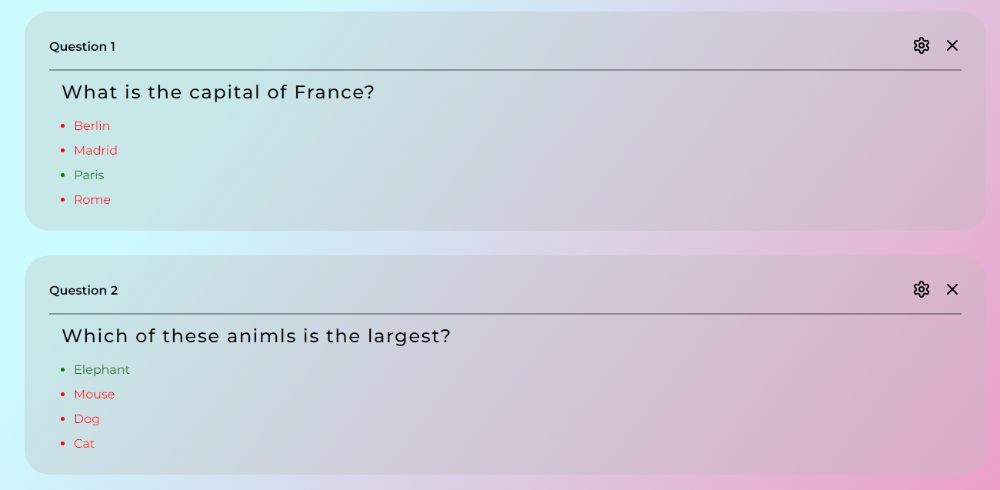

# AERO Create Test

_AERO Create Test_ - this is a project that creates tasks (tests) and it is also a quiz. Everyone can create their own assignment, afterwards a friend or student go through it. I built the side project for learning purposes. The goal of the project is to acquire new skills and experience with some technologies.

## 📦 Technologies

- `Java Script`
- `React`
- `Vite`
- `React Router`
- `React Hook Form`
- `Sass`
- `Zustand`
- `Jest`

## 🎨 Features

**How to use?**

- **Create!** First, create several tasks and enter a question in the Question field, and add several options for the answer below. **Important! Mark only one correct answer!** Add a few more tasks and click **save**.😉 Look! It's great, right?
  
  Oops! There seems to be a mistake in the task! Let's get it right! Click ⚙
  
  You can also delete any task ❌

- **Check it out!** Click on the button **show test** or ▶.
  

- **Test it out!** Let's take the test and see the result.
  
  Congratulations! 100% 🎉🎉🎉

## 🪓 The Process

At first, I had the idea to create something of this kind. Then I roughly visualized what it should look like.
I started with the home page, which I tried to make minimalistic and beautiful, without excess. To navigate between pages, I needed Routing. I used `React Router DOM`. I added a little interactivity for the user's convenience.
Next, I moved on to developing the **"Creation"** page. I determined for myself that there should be a form here, in which tasks will be created, and cards with ready-made tasks. When writing the `Form` component, I discovered for myself the React Compound Component Pattern, worked with the `useContext` hook, where I transferred the props. This approach I used in some other components, but slightly modified.
I also decided to use `React Hook Form`  to validate my fields, tried a lot of functionality and API, I found a lot of useful things that I can use in future projects. But stopped at what is in the code. Even then, many problems began to arise, the main one is that every time I saved changes, I had to clear the form and create a new one, which also had to be identified, and when editing a task turn on this particular form, to avoid mistakes and unforeseen events. Another problem arose when validating the correct answers, I wanted to make it possible to choose only one correct answer, I had to write my own function for validation, and it work. But, when editing a task, the form object is taken in advance and is not edited until we click **save**, and therefore this function sees only the number of correct answers that was previously available.
By the way, about forms and objects, how it works from the inside. There is an array consisting of objects, objects this is tasks. Each object is identified, and contains questions and all answers to them. To realize this, I decided to use the State manager the `Zustand`. I wrote several functions to fill this array: `addForm`, `deleteForm`, `updateForm`, `clearAll`. I also thought that it would be great, so that all created tasks remain when the browser is closed. So I decided to write the array to `localStorage`, and Zustand provides good, simple solutions for this. It was also necessary to create a custom hook `useCardItem`, which writes data from the form to a specific object, which is then written to the `store`.
Next, I wrote a component `Card` which took objects from the `store` and displayed each task in a separate card. You can edit and delete these cards.
I also added the `Control Panel` component to the page, which has three buttons, one runs the test and goes to another page, the second launches the function of shuffling questions on the "Show" page, the third launches the `Modal` component - modal window that warns you about deleting all tasks.
Next is the **"Show"** page. Here you can see the tasks, and also the ability to select the correct answer has been added. When you select an answer, its correctness is checked. And with the help of hook `useShowResult` the number of correct answers is calculated. `Control Panel` has a button that displays the result.
Then I set up `Prettier` to format the code, to make the code easy to read.
In the end, I set up test environment and learned how to write unit tests.

## 📚 What I Learned?

🌍 **Routing:** I've been working with the `React Router DOM`, and got good experience for writing a future of the apps.

🧠 **`useState, useEffect, useContext, useRef`:** I got experience in using the most popular hooks, understood the logic of work and the potential for their use, I found some life hacks for myself when working with them. I also wrote several custom hooks.

⛅ **State manager:** I got to know state managers and decided to choose `Zustand` for this project. Got acquainted with its capabilities and the API it provides, I learned how to use it in projects.

💼 **Local storage:** Got experience in working with web storage - localStorage and sessionStorage, I have read with the principles of their work, and also used the methods they provide. I decided to use Zustand capabilities. The Persist middleware enables you to store your Zustand state in a storage (e.g., localStorage, AsyncStorage, IndexedDB, etc.), thus persisting its data.

📃 **Compound Component Pattern:** learned about this pattern, I understood how to use it, and identified the pros and cons for myself, wrote several components based on this pattern, in particular `Form` component.

🔥 **React Hook Form:** worked with this tool, read almost all of its documentation and started using it in practice. For this project, I only needed a small form and simple validation, but in the course of my work, I realized how many opportunities this library provides and its importance, as most websites use various forms, fields, inputs, and React Hook Form improves the work with them.

🌄 **Modal window:** created a modal window that I used as a warning when deleting all tasks. Within this component, I needed to use the API `createPortal` with React DOM, this lets you render some children into a different part of the DOM.

📐 **Prettier & Eslint:** I got acquainted with these tools and customized them. I used Prettier to format the code, and Eslint for code analysis and error detection.

🧪 **Unit tests:** learned how to write unit tests. For this purpose, I chose the Jest framework and wrote several tests. But before that, I set up a test environment and installed the necessary plugins for correct work.

## 📈 Overall Growth:
In this project, I looked at React from a different angle, I tried to apply some programming patterns, tried to decompose my components, used the principles of inheritance and encapsulation.
This project gave me the skils to solve complex problems. I learned new tools and methods, improved his skills for future work and got experience in programming.

## ⭐ How can it be improved?
- Add shuffling of answer options.
- Improve form validation.
- Add the ability to generate a PDF document with ready-made tasks, which could be used for educational purposes.
- Add the ability to share a link to a task, complete it, and save the result.

## 🏃‍♂️ Running the Project
1. Clone the repository to your local machine.
2. Run `npm install` or `yarn` in the project directory to install the required dependencies.
3. Run `npm run dev` or `yarn dev` to get the project started.

## 😍 Performance
   
  
  
  
  

